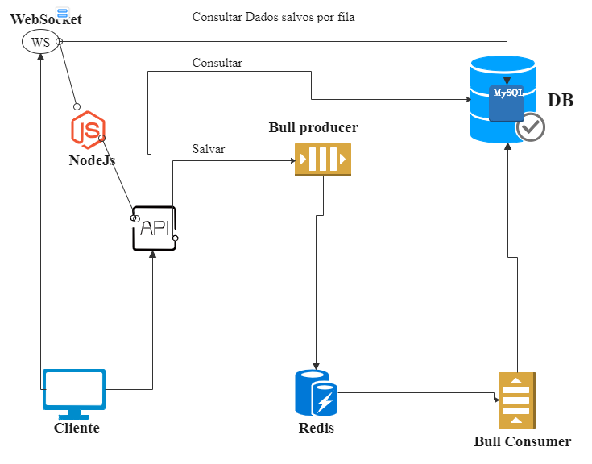

<h1>Trabalhar com Fila sem ambiente AWS</h1>

<h3>Tecnologias usadas no projeto</h3>
Bull e redis para filas (queue) 
Bull-board para monitoramento da fila 
Docker com conterner redis  
NodeJs com framework Express para rotas das APIs 
WebSocket server ws 
npm gerenciador de pacotes  
Docker conterner MySql banco de dados  
Docker-compose 
 

<h3>Requisitos para rodar projeto</h3>
Docker-compose é extremamente necessário pora rodar o MySql , redis, ws e armazenar as filas.
<h3>Diagrama fluxo do projeto</h3>

<h3>Passo a passo para iniciar projeto 
<h4>1° Clone o projeto</h4> 
<pre>
    git clone https://github.com/20100000/api-queue.git 
    cd api-queue
</pre>
<h4>2° Instale as dependências</h4>  
na raiz do projeto
crie node_module com as dependências. 
<pre>
    npm install
</pre>
<h4>3° Iniciar contaners com redis, mysql e node</h4>
já fiz tudo e só usar detalhe o banco de dados sera importado também com esse comando abaixo
<pre>
    docker-compose up
</pre>

<h4>5̣° Banco de dados</h4>
A base de dados vai ser executado na porta 3308 ex: jdbc:mysql://localhost:3308/  
Em docker-compose.yml configure database valores padrão. 
  HOST: '127.0.0.1', 
  PORT: '3608', 
  PASSWORD: 'root', 
  USER: 'root', 
  DATABASE: 'api_queue' 

<h4>Rotas APIs</h4>
Monitoramento da fila
<pre>
GET
http://localhost:3000/dashboard/queues
</pre>

Inserir produto para ser processado em fila
<pre>
POST
http://localhost:3000/product
{
    "name":"Name your product",
    "description": "Description product",
    "supplier_id" : 1
}
</pre>
Inserir fornecedor para ser processado em fila
<pre>
POST
http://localhost:3000/supplier
{
    "name":"Name your product",
    "doc": "Description product"
}
</pre>
Consutar todos
<pre>
GET
http://localhost:3000/product/
</pre>
<pre>
GET
http://localhost:3000/supplier/
</pre>

